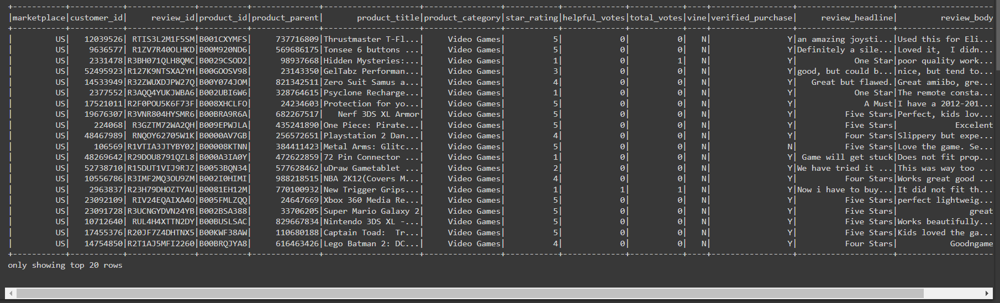
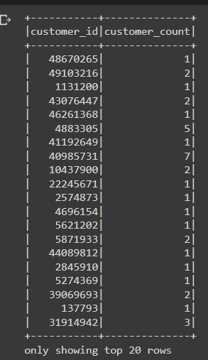
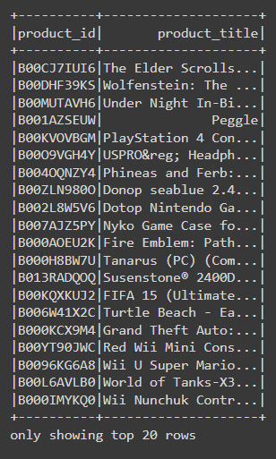
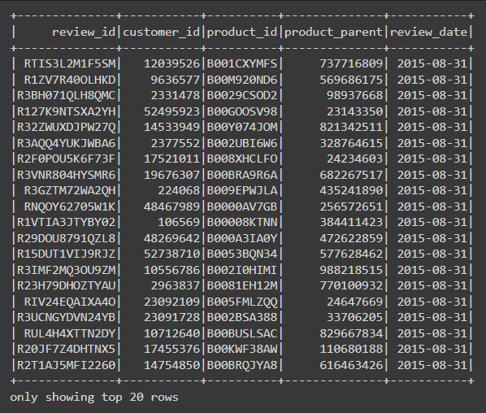
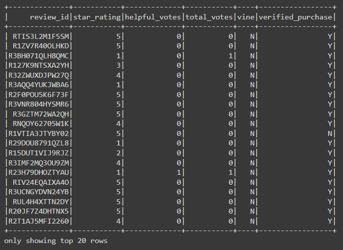
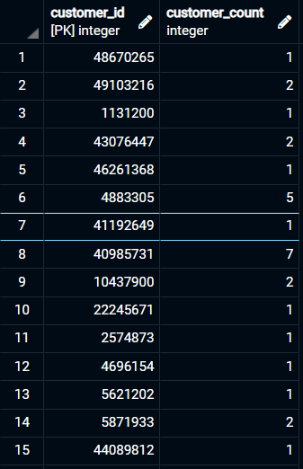
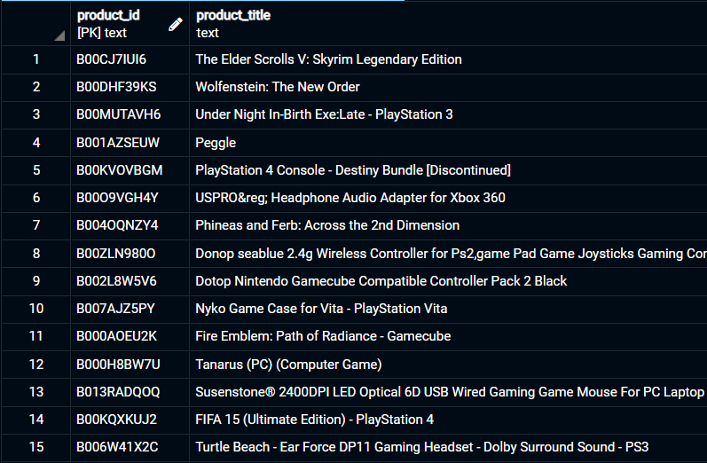
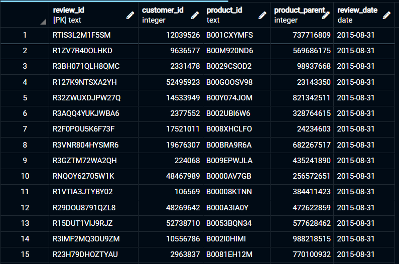

# Amazon_Vine_Analysis

## Overview

**The Amazon Vine program** is a service that allows manufacturers and publishers to receive reviews for their products. Companies like SellBy pay a small fee to Amazon and provide products to Amazon Vine members, who are then required to publish a review. This analysis focuses on the video game review dataset provided.

These datasets are analyzed using PySpark to perform the ETL process to extract the dataset, transform the data, connect to an AWS RDS instance, and load the transformed data into pgAdmin. Next, PySpark is used to determine if there is any bias toward favorable reviews from Vine members was present in the dataset. Spark requires several Python subpackages, which can be found in Google Colab. All that is needed to access Colab is a Google account. 

### Resources 

- [Google Colab](https://colab.research.google.com/notebooks/welcome.ipynb#scrollTo=5fCEDCU_qrC0)

- [Pyspark v 3.0.3](https://spark.apache.org/docs/3.0.3/api/python/index.html)

- [AWS postgreSQL RDS v. 11.13](https://docs.aws.amazon.com/AmazonRDS/latest/UserGuide/CHAP_GettingStarted.CreatingConnecting.PostgreSQL.html#CHAP_GettingStarted.Connecting.PostgreSQL.pgAdmin)

- [pgAdmin 4 v6.2](https://www.pgadmin.org/docs/pgadmin4/6.2/index.html3)

- [postgreSQL v 11.15](https://www.postgresql.org/docs/11/index.html)

#### Data

The video game reviews tsv dataset was selected from the following link:

- [Amazon Video Game Reviews Dataset](https://s3.amazonaws.com/amazon-reviews-pds/tsv/index.txt)

### Creating a new Databas instance in AWS using RDS with postgreSQL connectivity:

1. Follow the [documentation](https://docs.aws.amazon.com/AmazonRDS/latest/UserGuide/CHAP_GettingStarted.CreatingConnecting.PostgreSQL.html#CHAP_GettingStarted.Connecting.PostgreSQL.pgAdmin) to create a postgreSQL RDS in AWS.

2. In pgAdmin, create a new database in the AWS server. Then using [this schema](\Resources\schemas\challenge_schema.sql), run a new query to create the tables:
  - `customers_table`
  - `products_table`
  - `review_id_table`
  - `vine_table` 

3. Using Google Colab, initiate Spark with this code: 

``` Python
import os
# Find the latest version of spark 3.0 from http://www.apache.org/dist/spark/ and enter as the spark version
# For example:
# spark_version = 'spark-3.0.3'
spark_version = 'spark-3.0.3'
os.environ['SPARK_VERSION']=spark_version

# Install Spark and Java
!apt-get update
!apt-get install openjdk-11-jdk-headless -qq > /dev/null
!wget -q http://www.apache.org/dist/spark/$SPARK_VERSION/$SPARK_VERSION-bin-hadoop2.7.tgz
!tar xf $SPARK_VERSION-bin-hadoop2.7.tgz
!pip install -q findspark

# Set Environment Variables
import os
os.environ["JAVA_HOME"] = "/usr/lib/jvm/java-11-openjdk-amd64"
os.environ["SPARK_HOME"] = f"/content/{spark_version}-bin-hadoop2.7"

# Start a SparkSession
import findspark
findspark.init()
```

4. Then, connect AWS instance to pgAdmin:  

```Python
# Download the Postgres driver that will allow Spark to interact with Postgres.
!wget https://jdbc.postgresql.org/download/postgresql-42.2.16.jar
```
```Python
from pyspark.sql import SparkSession
spark = SparkSession.builder.appName("M16-Amazon-Challenge").config("spark.driver.extraClassPath","/content/postgresql-42.2.16.jar").getOrCreate()
```

5. Extract the data set and create a new dataframe:

```Python
from pyspark import SparkFiles
url = "https://s3.amazonaws.com/amazon-reviews-pds/tsv/amazon_reviews_us_Video_Games_v1_00.tsv.gz"
spark.sparkContext.addFile(url)
df = spark.read.option("encoding", "UTF-8").csv(SparkFiles.get("amazon_reviews_us_Video_Games_v1_00.tsv.gz"), sep="\t", header=True, inferSchema=True)
df.show()
```


6. Create the `customers_table` Dataframe:

```Python
# Create the customers_table DataFrame
customers_df = df.groupby("customer_id").agg({"customer_id":"count"}).withColumnRenamed("count(customer_id)", "customer_count")
customers_df.show()
```


7. Create the `products_table` Dataframe:

```Python
# Create the products_table DataFrame and drop duplicates. 
products_df = df.select(["product_id","product_title"]).drop_duplicates()
products_df.show()
```


8. Create the `review_id_table` Dataframe:

```Python
# Create the review_id_table DataFrame. 
# Convert the 'review_date' column to a date datatype with to_date("review_date", 'yyyy-MM-dd').alias("review_date")
review_id_df = df.select(["review_id","customer_id","product_id","product_parent", to_date("review_date", 'yyyy-MM-dd').alias("review_date")])
review_id_df.show()
```


9. Create the `vine_table` Dataframe:

```Python
# Create the vine_table. DataFrame
vine_df = df.select(["review_id","star_rating","helpful_votes","total_votes","vine","verified_purchase"])
vine_df.show()
```


10. Connect to the AWS RDS instance and write each DataFrame to its table in pgAdmin:

```Python
from getpass import getpass
password = getpass('Enter database password')
# Configure settings for RDS
mode = "append"
jdbc_url="jdbc:postgresql://amazonvine-db.cj43rteneqvx.us-west-2.rds.amazonaws.com:5432/postgres"
config = {"user":"postgres", 
          "password": password, 
          "driver":"org.postgresql.Driver"}
```
- `customers_table`

```Python
# Write customers_df to table in RDS
customers_df.write.jdbc(url=jdbc_url, table='customers_table', mode=mode, properties=config)
```

- `products_table`

```Python
# Write products_df to table in RDS
products_df.write.jdbc(url=jdbc_url, table='products_table', mode=mode, properties=config)
```

- `review_id_table`

```Python
# Write review_id_df to table in RDS
review_id_df.write.jdbc(url=jdbc_url, table='review_id_table', mode=mode, properties=config)
```

- `vine_table`

```Python
# Write vine_df to table in RDS
# 11 minutes
vine_df.write.jdbc(url=jdbc_url, table='vine_table', mode=mode, properties=config)
```

> These blocks will take upwards of 10 mins each to write into AWS, make sure to double check for errors!


11. Run a query to check the data in pgAdmin. Shown are the first 15 rows from each table after running the queries:

- `customers_table`



- `products_table`



- `review_id_table`



- `vine_table`


