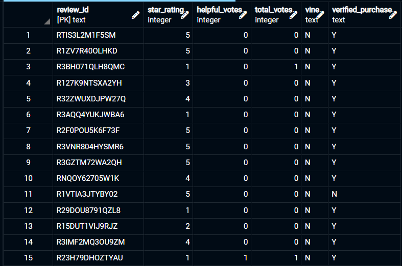
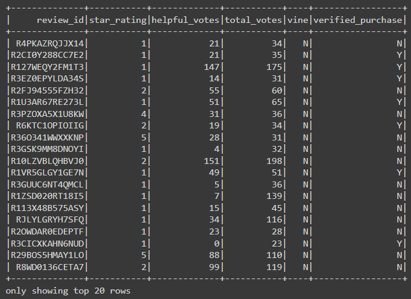
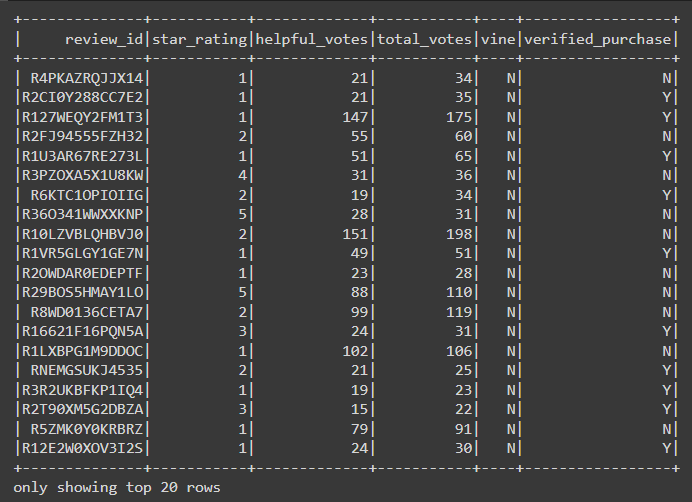
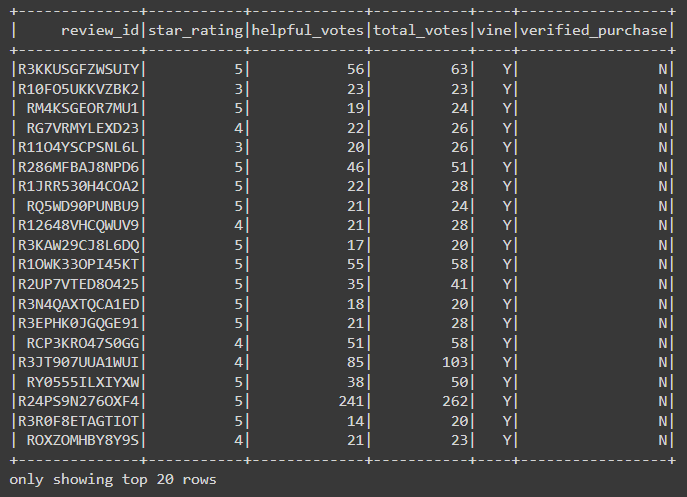
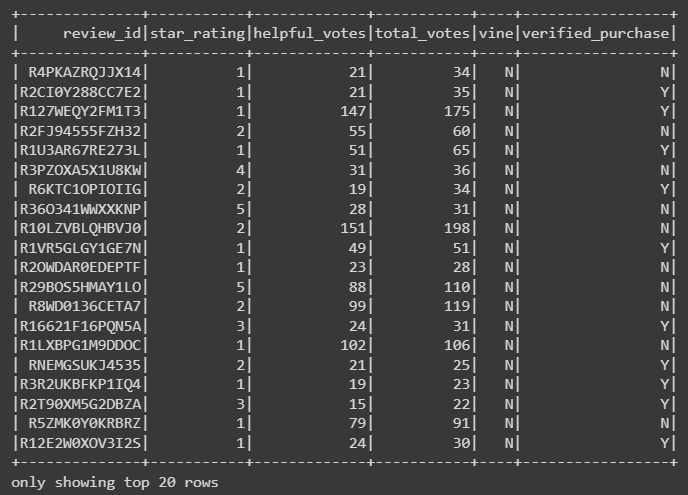

# Amazon_Vine_Analysis

## Overview

**The Amazon Vine program** is a service that allows manufacturers and publishers to receive reviews for their products. Companies like SellBy pay a small fee to Amazon and provide products to Amazon Vine members, who are then required to publish a review. This analysis focuses on the video game review dataset provided.

These datasets are analyzed using PySpark to perform the ETL process to extract the dataset, transform the data, connect to an AWS RDS instance, and load the transformed data into pgAdmin. Next, PySpark is used to determine if there is any bias toward favorable reviews from Vine members was present in the dataset. Spark requires several Python sub-packages, which can be found in Google Colab. All that is needed to access Colab is a Google account. 

### Resources 

- [Google Colab](https://colab.research.google.com/notebooks/welcome.ipynb#scrollTo=5fCEDCU_qrC0)

- [Pyspark v 3.0.3](https://spark.apache.org/docs/3.0.3/api/python/index.html)

- [AWS postgreSQL RDS v. 11.13](https://docs.aws.amazon.com/AmazonRDS/latest/UserGuide/CHAP_GettingStarted.CreatingConnecting.PostgreSQL.html#CHAP_GettingStarted.Connecting.PostgreSQL.pgAdmin)

- [pgAdmin 4 v6.2](https://www.pgadmin.org/docs/pgadmin4/6.2/index.html3)

- [postgreSQL v 11.15](https://www.postgresql.org/docs/11/index.html)

#### Data

The video game reviews tsv dataset was selected from the following link:

- [Amazon Video Game Reviews Dataset](https://s3.amazonaws.com/amazon-reviews-pds/tsv/index.txt)

### Creating a new Databas instance in AWS using RDS with postgreSQL connectivity:

1. Follow the [documentation](https://docs.aws.amazon.com/AmazonRDS/latest/UserGuide/CHAP_GettingStarted.CreatingConnecting.PostgreSQL.html#CHAP_GettingStarted.Connecting.PostgreSQL.pgAdmin) to create a postgreSQL RDS in AWS.

2. In pgAdmin, create a new database in the AWS server. Then using the schema file provided in the resources folder, run a new query to create the following tables:
  - `customers_table`
  - `products_table`
  - `review_id_table`
  - `vine_table` 

3. Using Google Colab, initiate Spark with this code: 

``` Python
import os
# Find the latest version of spark 3.0 from http://www.apache.org/dist/spark/ and enter as the spark version
# For example:
# spark_version = 'spark-3.0.3'
spark_version = 'spark-3.0.3'
os.environ['SPARK_VERSION']=spark_version

# Install Spark and Java
!apt-get update
!apt-get install openjdk-11-jdk-headless -qq > /dev/null
!wget -q http://www.apache.org/dist/spark/$SPARK_VERSION/$SPARK_VERSION-bin-hadoop2.7.tgz
!tar xf $SPARK_VERSION-bin-hadoop2.7.tgz
!pip install -q findspark

# Set Environment Variables
import os
os.environ["JAVA_HOME"] = "/usr/lib/jvm/java-11-openjdk-amd64"
os.environ["SPARK_HOME"] = f"/content/{spark_version}-bin-hadoop2.7"

# Start a SparkSession
import findspark
findspark.init()
```

4. Then, connect AWS instance to pgAdmin:  

```Python
# Download the Postgres driver that will allow Spark to interact with Postgres.
!wget https://jdbc.postgresql.org/download/postgresql-42.2.16.jar
```
```Python
from pyspark.sql import SparkSession
spark = SparkSession.builder.appName("M16-Amazon-Challenge").config("spark.driver.extraClassPath","/content/postgresql-42.2.16.jar").getOrCreate()
```

5. Extract the data set and create a new dataframe:

```Python
from pyspark import SparkFiles
url = "https://s3.amazonaws.com/amazon-reviews-pds/tsv/amazon_reviews_us_Video_Games_v1_00.tsv.gz"
spark.sparkContext.addFile(url)
df = spark.read.option("encoding", "UTF-8").csv(SparkFiles.get("amazon_reviews_us_Video_Games_v1_00.tsv.gz"), sep="\t", header=True, inferSchema=True)
df.show()
```


6. Create the `customers_table` Dataframe:

```Python
# Create the customers_table DataFrame
customers_df = df.groupby("customer_id").agg({"customer_id":"count"}).withColumnRenamed("count(customer_id)", "customer_count")
customers_df.show()
```


7. Create the `products_table` Dataframe:

```Python
# Create the products_table DataFrame and drop duplicates. 
products_df = df.select(["product_id","product_title"]).drop_duplicates()
products_df.show()
```


8. Create the `review_id_table` Dataframe:

```Python
# Create the review_id_table DataFrame. 
# Convert the 'review_date' column to a date datatype with to_date("review_date", 'yyyy-MM-dd').alias("review_date")
review_id_df = df.select(["review_id","customer_id","product_id","product_parent", to_date("review_date", 'yyyy-MM-dd').alias("review_date")])
review_id_df.show()
```


9. Create the `vine_table` Dataframe:

```Python
# Create the vine_table. DataFrame
vine_df = df.select(["review_id","star_rating","helpful_votes","total_votes","vine","verified_purchase"])
vine_df.show()
```


10. Connect to the AWS RDS instance and write each DataFrame to its table in pgAdmin:

```Python
from getpass import getpass
password = getpass('Enter database password')
# Configure settings for RDS
mode = "append"
jdbc_url="jdbc:postgresql://amazonvine-db.cj43rteneqvx.us-west-2.rds.amazonaws.com:5432/postgres"
config = {"user":"postgres", 
          "password": password, 
          "driver":"org.postgresql.Driver"}
```
- `customers_table`

```Python
# Write customers_df to table in RDS
customers_df.write.jdbc(url=jdbc_url, table='customers_table', mode=mode, properties=config)
```

- `products_table`

```Python
# Write products_df to table in RDS
products_df.write.jdbc(url=jdbc_url, table='products_table', mode=mode, properties=config)
```

- `review_id_table`

```Python
# Write review_id_df to table in RDS
review_id_df.write.jdbc(url=jdbc_url, table='review_id_table', mode=mode, properties=config)
```

- `vine_table`

```Python
# Write vine_df to table in RDS
# 11 minutes
vine_df.write.jdbc(url=jdbc_url, table='vine_table', mode=mode, properties=config)
```

> Uploading each DataFrame can take up to 10 minutes or longer, so it’s a good idea to double-check your work before uploading. If you have problems uploading your work, you may have to shut down the pgAdmin server and restart.

11. Run a query to check the data in pgAdmin. Shown are the first 15 rows from each table after running the queries:

- `customers_table`


- `products_table`


- `review_id_table`


- `vine_table`



## Determining Bias of Vine Reviews

### Results

1. After initiating a new Spark Session and the video game dataset is extracted, the same `vine_table` dataframe was created in using this code:

```Python
vine_df = df.select(["review_id","star_rating","helpful_votes","total_votes","vine","verified_purchase"])
vine_df.show()
```


2. Pick reviews that are more likely to be helpful and to avoid having division by zero errors later on:

```Python
vine_review_total_votes = vine_df.filter("total_votes>=20")
vine_review_total_votes.show()
```



3. Create a dataframe that retrieves rows where percentage of helpful votes is greater than or equal to 50%:

```Python
vine_helpful = vine_review_total_votes.filter("helpful_votes/total_votes>=0.5")
vine_helpful.show()
```



4. Create a dataframe retrieving rows with reviews written as a part of a Vine program:

```Python
vine_paid = vine_helpful.filter("vine=='Y'")
vine_paid.show()
```



5. Create a df retrieving rows with reviews written were NOT a part of a Vine program:

```Python
vine_unpaid = vine_helpful.filter("vine=='N'")
vine_unpaid.show()
```



6. Lastly, we can determine the total number of reviews, the number of 5-star reviews, and the percentage of 5-star reviews for the two types of review (paid vs unpaid):

```Python
# Total number of reviews
total_reviews = vine_helpful.count()
total_reviews
```
> 40565

```Python
# Total five star reviews
five_star_total = vine_helpful.filter(vine_helpful['star_rating']==5)
five_star_total.count()
```
> 15711

```Python
# Percent of paid 5 star reviews
five_star_paid = vine_paid.filter(vine_paid['star_rating']==5)
percent_of_five_star_paid= five_star_paid.count()/vine_paid.count()*100
percent_of_five_star_paid
```
> 51.06382978723404

```Python
# Percent of unpaid 5 star reviews
five_star_unpaid = vine_unpaid.filter(vine_unpaid['star_rating']==5)
percent_of_five_star_unpaid = five_star_unpaid.count()/vine_unpaid.count()*100
percent_of_five_star_unpaid
```
> 38.701786464381904

## Summary 

This analysis compares the total 5 * reviews with either paid or unpaid Vine programs. The unpaid 5* reviews (38.7%), show a much less favorability when compared to the paid 5* reviews (51.1%). However, upon further analysis, the paid 5* reviews account for only 48 of the total 15,711 5 * reviews (0.3%). Furthermore, the total 5 * reviews account for roughly 38.73% of the total reviews, which is much closer to the percentage of unpaid 5 * reviews. These analysis points to some positivity bias in the vine paid program. 
